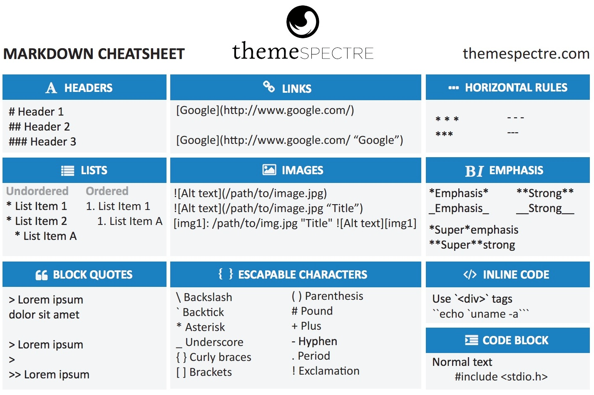

# h1
## h2
### h3

Instructions for setting ... (Normal text).

___
**Adding separation line horizontal line**
___

**Table of Contents:** Bold

*Table of Contents:* Italic

~~Table of Contents:~~ Strikethrough, line on the text

**Table *of* ~~Contents:~~** it's possible to use everthing together

# **Making a list**
1. Graphene Installation
    1. What is Graphene
    1. Who
    1. **Note:** Using 1. 1. 1. to make a list in sequence can help when you need to change the order of the itens on the list, the programa understand and take care. 
2. Creating Schemas
3. Using Graphiql

___
## **Making a unordered list**
There is 2 ways, you can use * or _

- Get only the data
- Easy to manage this way
* This work to but on some platforms they think you want to write a text on italic.


# **Adding a code block**
## **Inline code block**
Install Graphene: `pip install django_graphene`

In this case you will kind highlight the text or could show the text in format of code.

## **Multiline codeblock**
Here we gonna make lines of code fit inside of a black box. 

Also  we can define in which language of code we are writting, Python (py), JavaScript (js) and others. 
Just like when you define what language your file is before start coding.

```py
#Writing over a Tuple (in this case you practically create a new turple, losing the values on the first one):
dimensions = (200, 50)
print("Original dimensions:")
for dimension in dimensions:
    print(dimension)
dimensions = (400, 100)
print("\nModified dimensions:")
for dimension in dimensions:
    print(dimension)
```

# **Adding block code**
>“The secret to doing anything is believing that you can do it. Anything that you believe you can do strong enough, you can do. Anything. As long as you believe.”
> -- <cite>Bob Ross</cite> -- 
>> This is a way to create a block quote inside a block quote
>
-- <cite>Bob Ross</cite> -- 
> 
-- *Bob Ross*

*This is a way to make a citation, there is no right way, there is multiple ways*

___
## **How to make internal link**
In this case we are going up to 'Making a list'. It's going to work just like variables and when you write just all the text is going to be on lowercase, even if the part you want is in uppercase.

**Note:** Punctuation isn't needed when you going to make a link (? , . , ! ).

[Making a list](#making-a-list)

___
## **How to make external links**
[Graphene documentation](https://docs.graphene-python.org/projects/django/en/latest/)

___
## **Adding a image**


You can also insert a external link in the image

[](https://br.pinterest.com/pin/573505333775956020/)

___
## **We can use to HTML text**
Some text <br> some more text

___
## **We creat Checkboxes**
It's with a simple use, if a task is checked we put a X in the middle and empty if still havent checked.
- [x] Task #1
- [ ] Task #2
